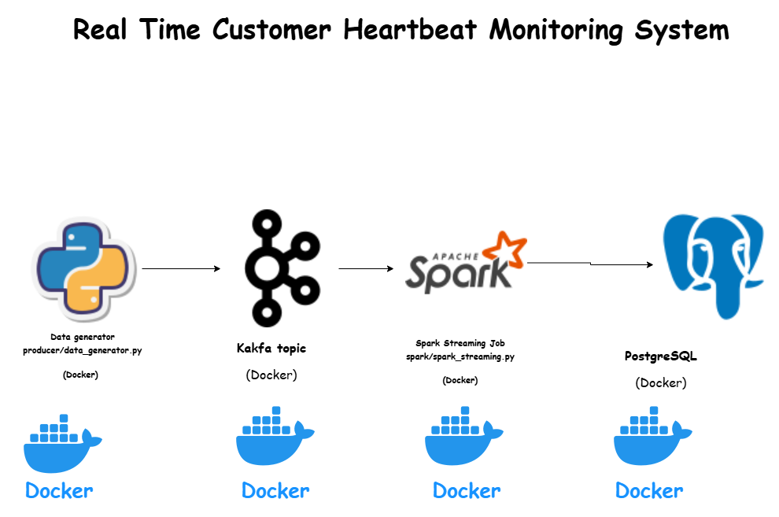

# Real-Time Customer Heartbeat Monitoring System

## Project Overview

The Real-Time Customer Heartbeat Monitoring System is a streaming data pipeline that simulates customer heart rate data, ingests it through Apache Kafka, processes it using Spark Structured Streaming, stores it in PostgreSQL, and visualizes it with Grafana.

The project began with a Python-based data generator and a Kafka consumer implementation. During development, the architecture was refined to align with real-world streaming best practices by replacing the standalone Kafka consumer with Spark Structured Streaming as the primary processing engine.

This project demonstrates core data engineering concepts including event streaming, distributed processing, database persistence, container orchestration, and observability.

---

## Architecture

**Data Flow**

1. Python Data Generator produces synthetic heartbeat events.
2. Kafka Producer publishes events to a Kafka topic.
3. Spark Structured Streaming consumes events from Kafka.
4. Spark processes and writes data into PostgreSQL.
5. Grafana connects to PostgreSQL for visualization.

---

### Architecture Diagram

---

## Technology Stack

* Python 3.11
* Apache Kafka
* Apache Zookeeper
* Apache Spark 3.5 (Structured Streaming)
* PostgreSQL 14
* Grafana
* Docker & Docker Compose

---

## Project Structure

```
.
├── Script/
│   ├── db/
│   │   └── schema.sql
│   ├── logs/
│   ├── producer/
│   │   ├── config.py
│   │   ├── data_generator.py
│   │   ├── logging_config.py
│   │   └── wait-for-kafka.sh
│   ├── consumer/
│   │   ├── kafka_consumer.py
│   │   └── wait-for-kafka.sh
│   └── spark/
│       ├── jars/
│       │   └── postgresql-42.7.6.jar
│       └── spark_streaming.py
│
├── .env
├── docker-compose.yml
├── Dockerfile
├── requirements.txt
└── README.md
```

---

## Core Components

### 1. Data Generator

Located in:

```
Script/producer/data_generator.py
```

Responsibilities:

* Simulates realistic heart rate readings
* Generates fields:

  * patient_id
  * timestamp
  * heart_rate
  * status
* Publishes events to Kafka continuously
* Uses structured logging

---

### 2. Kafka

* Zookeeper manages Kafka metadata.
* Kafka broker receives messages from the producer.
* Events are written to a configured topic.
* Health checks ensure broker readiness before producers and Spark start.

---

### 3. Spark Structured Streaming

Located in:

```
Script/spark/spark_streaming.py
```

Responsibilities:

* Reads streaming data from Kafka
* Parses and validates JSON messages
* Writes processed data to PostgreSQL using JDBC
* Uses the PostgreSQL driver stored in:

```
Script/spark/jars/postgresql-42.7.6.jar
```

Spark replaces the original standalone Kafka consumer and represents a more production-aligned streaming architecture.

---

### 4. PostgreSQL

* Stores heartbeat records
* Schema initialized via:

```
Script/db/schema.sql
```

Example table:

```
heartbeats(
    id SERIAL PRIMARY KEY,
    patient_id INTEGER,
    timestamp TIMESTAMP,
    heart_rate INTEGER,
    status VARCHAR
)
```

---

### 5. Grafana

* Connects to PostgreSQL
* Enables dashboard visualization
* Runs on:

```
http://localhost:3000
```

Default credentials:

* Username: admin
* Password: admin

---

## Docker Configuration

### Dockerfile

* Base image: Python 3.11-slim
* Working directory: `/Script`
* Installs netcat for readiness checks
* Copies application code
* Sets:

```
ENV PYTHONPATH=/Script
```

---

### docker-compose Services

* zookeeper
* kafka
* postgres
* producer
* spark
* grafana

Kafka and PostgreSQL include health checks.
Spark and producer wait for dependencies before execution.

---

## How to Run the Project

### 1. Prerequisites

* Docker
* Docker Compose

---

### 2. Clone Repository

```
git clone <repository-url>
cd <repository-folder>
```

---

### 3. Configure Environment Variables

Edit `.env` if needed.

---

### 4. Build Containers

```
docker compose build
```

---

### 5. Start Infrastructure (Without Producer)

Start Zookeeper, Kafka, PostgreSQL, Spark, and Grafana:

```
docker compose up zookeeper kafka postgres spark grafana
```

Wait until:

* Kafka health check passes
* PostgreSQL is ready
* Spark job starts successfully

---

### 6. Verify Database Connectivity

Access PostgreSQL:

```
docker exec -it postgres psql -U postgres -d heartbeat_db
```

Check table:

```
SELECT * FROM heartbeats;
```

At this stage, the table should be empty.

---

### 7. Start Data Producer

In a new terminal:

```
docker compose up producer
```

You should now observe:

* Producer logs generating data
* Spark logs processing micro-batches
* PostgreSQL receiving inserts

---

## Evidence of Data Ingestion

Insert database proof screenshots here:

```
[ Database Insert Screenshot Placeholder ]
```

Example verification query:

```
SELECT count(*) FROM heartbeats;
```

```
SELECT * FROM heartbeats ORDER BY timestamp DESC LIMIT 10;
```

---

## Grafana Dashboard

1. Open:

   ```
   http://localhost:3000
   ```

2. Add PostgreSQL as a data source.

3. Connect to:

   * Host: postgres:5432
   * Database: heartbeat_db
   * User: postgres
   * Password: postgres

Insert Grafana dashboard screenshots here:

```
[ Grafana Dashboard Screenshot Placeholder ]
```

---

## Development Evolution

The project initially included:

* A Kafka-based Python consumer (`kafka_consumer.py`).

During development, the architecture was improved by:

* Replacing the standalone Kafka consumer with Spark Structured Streaming.
* Using Spark for scalable, fault-tolerant streaming ingestion.
* Leveraging JDBC for structured database writes.

The original Kafka consumer remains in the repository for reference and comparison.

---

## Learning Outcomes

This project demonstrates:

* Event-driven architecture
* Kafka-based streaming pipelines
* Structured Streaming with Spark
* Database integration using JDBC
* Container orchestration with Docker Compose
* Observability with Grafana
* Real-time system debugging and health monitoring

---


## Deliverables

* Data generator script
* Kafka producer
* Spark streaming job
* PostgreSQL schema
* Dockerfile
* docker-compose.yml
* README documentation
* Architecture diagram
* Database ingestion proof
* Grafana dashboard proof

---

## Conclusion

This project provides a complete end-to-end real-time data pipeline using modern data engineering tools. It demonstrates the evolution from a simple Kafka consumer model to a distributed Spark-based streaming architecture, aligning more closely with real-world production systems.
